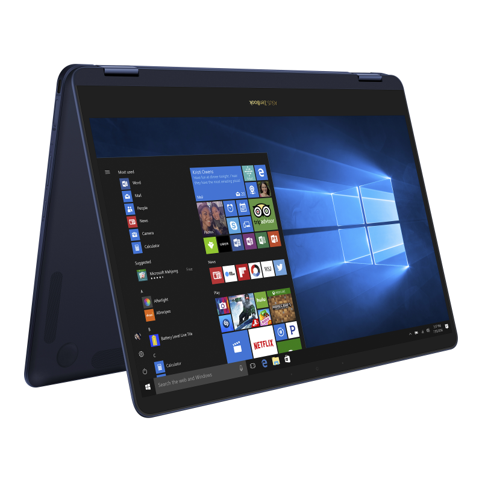
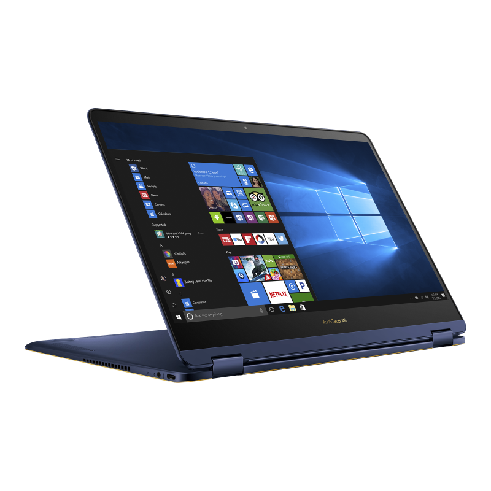
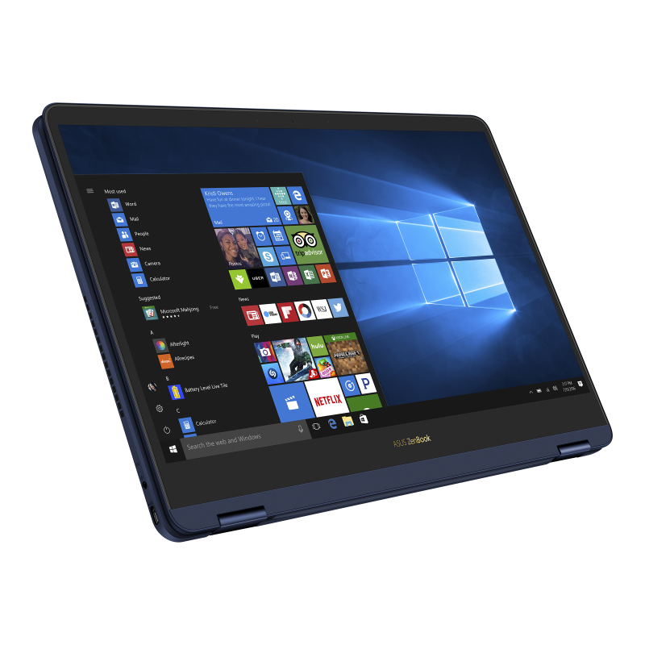

# ASUS ZenBook Flip S (Q325UAR / UX370UAR) Setup

My personal device configuration and power optimization setup for Linux Mint on the ASUS ZenBook 13 Flip.

## Device

<p align="center">
  
  
  
</p>

<p align="center">
  
</p>

## Hardware Specs

| Component | Detail |
|-----------|--------|
| **Model** | ASUS ZenBook Flip S Q325UAR (UX370UAR) |
| **CPU** | Intel Core i7-8550U @ 1.80GHz (4 cores / 8 threads, Kaby Lake R) |
| **GPU** | Intel UHD Graphics 620 (integrated only) |
| **RAM** | 16 GB |
| **Storage** | SanDisk SD8SN8U512G1002 512GB SSD |
| **Display** | 13.3" 1920x1080 touchscreen (convertible, 360° hinge) |
| **Touchscreen** | ELAN24CC (04F3:24CC) via I2C — touch + MPP stylus |
| **Stylus** | Microsoft Pen Protocol (MPP 1.0) — ASUS Pen SA200H compatible |
| **Accelerometer** | HID-SENSOR-200073 (accel_3d) via Intel Sensor Hub — for auto-rotation |
| **Hinge Sensor** | HID-SENSOR-INT-020b — reports lid angle for tablet mode detection |
| **WiFi** | Intel Wireless 8260 |
| **Bluetooth** | Intel 8260 (via USB) |
| **Webcam** | IMC Networks USB2.0 VGA UVC WebCam |
| **Fingerprint** | Goodix GXFP3200 (SPI) — not supported on Linux |

## Battery

| Spec | Value |
|------|-------|
| **Part Number** | C21N1624 |
| **Type** | 2-cell Li-ion |
| **Voltage** | 7.7V |
| **Design Capacity** | 39 Wh (5070 mAh) |
| **Current Capacity** | 30.3 Wh (77.6% health) |
| **Charge Cycles** | 407 |
| **Replacement** | C21N1624 (39 Wh only, no higher capacity available) |

## Operating System

| | |
|---|---|
| **OS** | Linux Mint 22.1 (Xia) |
| **Base** | Ubuntu Noble (24.04) |
| **Kernel** | 6.8.0-63-generic |
| **Desktop** | Cinnamon (Xorg) |

## Power Optimization

### Active Services

| Service | Purpose | Status |
|---------|---------|--------|
| **TLP** | Automated power management (CPU, USB, WiFi, disk) | Enabled |
| **thermald** | Intel thermal management and CPU throttling | Enabled |
| **powertop-autotune** | Applies powertop power-saving tunables at boot | Enabled |

### Setup Commands

```bash
# Install power management tools
sudo apt install tlp tlp-rdw powertop

# Enable TLP and prevent conflicts
sudo systemctl enable --now tlp
sudo systemctl mask power-profiles-daemon

# Calibrate powertop (must be on battery)
sudo powertop --calibrate
sudo powertop --auto-tune

# Create powertop systemd service
sudo tee /etc/systemd/system/powertop-autotune.service << 'EOF'
[Unit]
Description=PowerTOP auto-tune
After=multi-user.target

[Service]
Type=oneshot
ExecStart=/usr/sbin/powertop --auto-tune
RemainAfterExit=true

[Install]
WantedBy=multi-user.target
EOF

sudo systemctl daemon-reload
sudo systemctl enable --now powertop-autotune.service
```

### Battery Charge Limit

Set to 85% via TLP to preserve long-term battery health. The charge threshold is exposed by the `asus-nb-wmi` kernel module and TLP writes to it at boot.

```bash
# Uncomment and set in /etc/tlp.conf:
sudo sed -i 's/^#STOP_CHARGE_THRESH_BAT0=.*/STOP_CHARGE_THRESH_BAT0=85/' /etc/tlp.conf

# Apply immediately:
sudo tlp start

# Verify:
cat /sys/class/power_supply/BAT0/charge_control_end_threshold
# Should output: 85
```

> **Note:** Some ASUS laptops silently ignore thresholds other than 40, 60, or 80. If the battery charges past the set limit, change the value to 80.

### Undervolting

The i7-8550U supports undervolting via MSR 0x150 (OC Mailbox) using [intel-undervolt](https://github.com/kitsunyan/intel-undervolt). However, the kernel's early microcode update (`0xf6`) locks the undervolt register as part of the Plundervolt (CVE-2019-11157) mitigation — even though the BIOS (version 300) is pre-patch.

To re-enable undervolting, microcode loading is disabled via GRUB:

```bash
# In /etc/default/grub:
GRUB_CMDLINE_LINUX_DEFAULT="quiet splash dis_ucode_ldr"

sudo update-grub
sudo reboot
```

This disables mitigations for SRBDS and GDS, which are local-only attack vectors and low risk on a personal laptop.

After reboot, install and configure intel-undervolt:

```bash
cd /tmp
git clone https://github.com/kitsunyan/intel-undervolt.git
cd intel-undervolt
./configure --enable-systemd
make
sudo make install
```

Configure `/etc/intel-undervolt.conf` with the stable values determined through testing:

```
undervolt 0 'CPU' -100
undervolt 1 'GPU' -80
undervolt 2 'CPU Cache' -100
undervolt 3 'System Agent' 0
undervolt 4 'Analog I/O' 0
```

Apply and verify:

```bash
sudo intel-undervolt apply
sudo intel-undervolt read
```

Enable at boot and after suspend/resume:

```bash
sudo systemctl enable intel-undervolt.service
sudo systemctl enable intel-undervolt-loop.service
```

Stability was verified with `stress-ng`:

```bash
stress-ng --cpu 0 --cpu-method all --timeout 2m --metrics-brief
```

> **Note:** -120 mV on core/cache caused a crash on this chip. -100 mV passed stress testing with 0 failures, leaving a 20 mV margin from the instability threshold.

### Fn / Media Key Remapping

#### The Problem

On this laptop, the F-row defaults to F1-F12 and requires holding Fn for media keys (volume, brightness, etc.). The Fn key is handled entirely by the embedded controller (EC) at the firmware level and is invisible to Linux.

Two issues had to be solved:

1. **The EC was swallowing media key events** — when pressing Fn+media keys, the EC handled the action internally (changing brightness/volume at the hardware level) without sending WMI notifications to the OS. The `Asus WMI hotkeys` input device existed but never fired events.

2. **Swapping F-keys and media keys** — making bare keypresses send media functions and Fn+key send F1-F12.

#### What Didn't Work

- **`asus_wmi fnlock_default=N/Y`** — The UX370UAR BIOS (version 300) does not support the `ASUS_WMI_DEVID_FNLOCK` WMI method. The parameter is accepted but the firmware ignores it.
- **`Fn+Esc` toggle** — Not functional on this model.
- **`asusctl`** — Designed for 2020+ ROG/TUF laptops, not applicable.
- **`asus-wmi-dkms` / `acpi4asus-dkms`** — Outdated, no UX370-specific patches.
- **Cinnamon custom keybindings for F5/F6** — Cinnamon's built-in media key handler grabs `XF86MonBrightnessDown`/`Up` at a lower level, preventing custom keybindings from intercepting them.

#### Architecture

The solution has four layers:

```
┌──────────────────────────────────────────────────────────────────┐
│  Layer 1: Kernel — acpi_osi= forces EC to send WMI events       │
├──────────────────────────────────────────────────────────────────┤
│  Layer 2: xmodmap — bidirectional F-key / media key swap         │
├──────────────────────────────────────────────────────────────────┤
│  Layer 3: Key interception                                       │
│    ├── xbindkeys → F5/F6 (brightness up/down)                   │
│    └── Cinnamon custom keybindings                               │
│         ├── F7 → brightness.sh toggle                            │
│         └── XF86Display → display-control.sh                     │
├──────────────────────────────────────────────────────────────────┤
│  Layer 4: Scripts                                                │
│    ├── brightness.sh — D-Bus brightness control with OSD         │
│    │    ├── up/down: mute-aware step with bounds checking        │
│    │    └── toggle: mute/unmute (save & restore brightness)      │
│    ├── display-control.sh — short/long press dispatcher          │
│    │    ├── short press (<2s): display-switch.sh                 │
│    │    └── long press (>2s): GNOME Network Displays (casting)   │
│    └── display-switch.sh — cycle display modes via xrandr        │
│         └── internal → mirror → extend → external → internal     │
└──────────────────────────────────────────────────────────────────┘
```

#### Solution Part 1: `acpi_osi=` Kernel Parameter

The BIOS DSDT contains `_OSI("Windows 2015")` conditional logic. When the kernel reports Windows 10 compatibility, the EC takes the modern code path and handles media keys internally. Setting `acpi_osi=` (empty, with trailing space) disables all `_OSI` responses, forcing the DSDT into the legacy code path where the EC sends WMI notifications to the OS.

```bash
# In /etc/default/grub (note the trailing space after =):
GRUB_CMDLINE_LINUX_DEFAULT="quiet splash dis_ucode_ldr acpi_osi= "

sudo update-grub
sudo reboot
```

After reboot, verify WMI events are coming through:

```bash
sudo evtest /dev/input/event11  # Asus WMI hotkeys
# Press Fn+F12 — should show KEY_VOLUMEUP events
```

#### Solution Part 2: Bidirectional `xmodmap` Swap

With WMI events now reaching X11, both the F-key keycodes (from bare keypresses) and the media keycodes (from Fn+keypresses via WMI) are visible. `xmodmap` swaps them at the X11 keycode level:

- Without Fn: F-key keycodes are remapped to media keysyms
- With Fn: WMI media keycodes are remapped back to F-key keysyms

See [`config/.Xmodmap`](config/.Xmodmap) for the full keymap. Install:

```bash
cp config/.Xmodmap ~/.Xmodmap
xmodmap ~/.Xmodmap
```

Autostart entry (`~/.config/autostart/xmodmap.desktop`) to persist across logins:

```bash
cp config/xmodmap.desktop ~/.config/autostart/
```

#### Solution Part 3: Brightness Control via `xbindkeys` + D-Bus

Brightness keys (F5/F6) need special handling because they support a **brightness mute** feature (F7). Cinnamon's built-in brightness handler doesn't know about the mute state, so it was disabled and replaced with a custom pipeline:

1. **Cinnamon's built-in brightness handler is disabled:**

```bash
gsettings set org.cinnamon.desktop.keybindings.media-keys screen-brightness-down "@as []"
gsettings set org.cinnamon.desktop.keybindings.media-keys screen-brightness-up "@as []"
```

2. **`xbindkeys` intercepts `XF86MonBrightnessDown`/`Up`** and routes them to `brightness.sh`:

See [`config/.xbindkeysrc`](config/.xbindkeysrc). Install:

```bash
sudo apt install xbindkeys
cp config/.xbindkeysrc ~/.xbindkeysrc
cp config/xbindkeys.desktop ~/.config/autostart/
xbindkeys
```

3. **F7 (brightness toggle) and F8 (display switch) are handled by Cinnamon custom keybindings:**

```bash
dconf write /org/cinnamon/desktop/keybindings/custom-list "['custom0','custom1']"

# F7 — brightness mute/unmute
dconf write /org/cinnamon/desktop/keybindings/custom-keybindings/custom0/name "'Brightness Toggle'"
dconf write /org/cinnamon/desktop/keybindings/custom-keybindings/custom0/command "'/home/shahmir/.local/bin/brightness.sh toggle'"
dconf write /org/cinnamon/desktop/keybindings/custom-keybindings/custom0/binding "['F7']"

# F8 — display switch / wireless casting
dconf write /org/cinnamon/desktop/keybindings/custom-keybindings/custom1/name "'Display Switch'"
dconf write /org/cinnamon/desktop/keybindings/custom-keybindings/custom1/command "'/home/shahmir/.local/bin/display-control.sh'"
dconf write /org/cinnamon/desktop/keybindings/custom-keybindings/custom1/binding "['XF86Display']"
```

> **Why two different key interception methods?** Cinnamon custom keybindings work for regular keysyms like `F7` and `XF86Display` but cannot grab `XF86MonBrightness*` keysyms even when the built-in handler is disabled. `xbindkeys` can grab them because it operates at the X11 level. Conversely, `xbindkeys` was not used for F7/F8 because the Cinnamon keybindings were already working.

#### Solution Part 4: `brightness.sh` Script

A single script ([`scripts/brightness.sh`](scripts/brightness.sh)) handles all brightness operations through Cinnamon's D-Bus interface (`org.cinnamon.SettingsDaemon.Power.Screen`). Using D-Bus instead of writing directly to `/sys/class/backlight/acpi_video0/brightness` keeps Cinnamon's internal brightness state in sync and triggers the proper ACPI methods.

Install:

```bash
cp scripts/brightness.sh ~/.local/bin/brightness.sh
chmod +x ~/.local/bin/brightness.sh
```

**Features:**

- **`brightness.sh up`** — If muted, restores to saved brightness first, then steps up. Shows OSD. No-op at 100%.
- **`brightness.sh down`** — If muted, restores to saved brightness first, then steps down. Shows OSD. No-op at 0%.
- **`brightness.sh toggle`** — Saves current brightness and sets to 0% (mute), or restores saved brightness (unmute). Shows OSD.
- **Concurrency protection** — Uses `flock` to drop duplicate events when keys are held down, preventing lag from queued D-Bus calls.
- **OSD at bounds** — Always shows the Cinnamon brightness popup, even when already at min/max, so the user gets visual feedback.
- **Error handling** — Logs to stderr if `csd-power` is unreachable.

#### Solution Part 5: Display Switch via `display-control.sh` + `display-switch.sh`

F8 (`XF86Display`) is handled by two scripts that provide both wired display switching and wireless casting:

- **[`scripts/display-control.sh`](scripts/display-control.sh)** — Detects press duration using `xinput` to monitor keycode 74 (F8) release:
  - **Short press (< 2 seconds):** Calls `display-switch.sh` to cycle display modes
  - **Long press (> 2 seconds):** Opens GNOME Network Displays for Miracast/Wi-Fi casting

- **[`scripts/display-switch.sh`](scripts/display-switch.sh)** — Cycles through four display modes using `xrandr`, similar to Windows Win+P:
  1. **Internal only** — laptop screen only
  2. **Mirror** — same image on laptop and external display
  3. **Extend** — external display to the right of laptop screen
  4. **External only** — laptop screen off, external display only

  If no external display is connected, shows a notification. State is tracked in `/tmp/.display_mode`.

Install:

```bash
sudo apt install gnome-network-displays
cp scripts/display-control.sh ~/.local/bin/
cp scripts/display-switch.sh ~/.local/bin/
chmod +x ~/.local/bin/display-control.sh ~/.local/bin/display-switch.sh
```

#### F-Row Key Map

| Key | Without Fn (media) | With Fn (function) | Notes |
|-----|-------------------|-------------------|-------|
| F1 | Sleep | F1 | |
| F2 | Airplane mode | F2 | |
| F3 | Keyboard backlight down | F3 | |
| F4 | Keyboard backlight up | F4 | |
| F5 | Display brightness down | F5 | Routed through `brightness.sh down` via xbindkeys |
| F6 | Display brightness up | F6 | Routed through `brightness.sh up` via xbindkeys |
| F7 | Brightness mute/unmute | F7 | Routed through `brightness.sh toggle` via Cinnamon keybinding |
| F8 | Display switch / cast | F8 | Short press: cycle display modes. Long press (>2s): open wireless casting |
| F9 | Touchpad toggle | F9 | |
| F10 | Mute | F10 | |
| F11 | Volume down | Volume down | WMI keycode 122 not remapped — shared with side volume rocker |
| F12 | Volume up | Volume up | WMI keycode 123 not remapped — shared with side volume rocker |

> **Side volume buttons:** The physical volume rocker on the side of the laptop (`gpio-keys`, `/dev/input/event12`) sends `KEY_VOLUMEDOWN` (114) and `KEY_VOLUMEUP` (115), which X11 maps to keycodes 122 and 123 — the same keycodes as the Fn+F11/Fn+F12 WMI events. XKB already maps keycodes 122/123 to `XF86AudioLowerVolume`/`XF86AudioRaiseVolume` by default, so these are intentionally **not remapped** in `.Xmodmap`. The trade-off is that Fn+F11/Fn+F12 send volume instead of F11/F12 keysyms — which is correct behaviour since they are volume keys.

#### Full Installation

All config files and scripts are in this repo under [`config/`](config/) and [`scripts/`](scripts/). To set up from scratch:

```bash
# 1. Kernel parameter (requires reboot)
# Add "acpi_osi= " (with trailing space) to GRUB_CMDLINE_LINUX_DEFAULT in /etc/default/grub
sudo update-grub && sudo reboot

# 2. Install dependencies
sudo apt install xbindkeys gnome-network-displays

# 3. Copy config files
cp config/.Xmodmap ~/
cp config/.xbindkeysrc ~/
cp config/xmodmap.desktop ~/.config/autostart/
cp config/xbindkeys.desktop ~/.config/autostart/

# 4. Install scripts
cp scripts/brightness.sh ~/.local/bin/
cp scripts/display-control.sh ~/.local/bin/
cp scripts/display-switch.sh ~/.local/bin/
chmod +x ~/.local/bin/brightness.sh ~/.local/bin/display-control.sh ~/.local/bin/display-switch.sh

# 5. Disable Cinnamon's built-in brightness key handler
gsettings set org.cinnamon.desktop.keybindings.media-keys screen-brightness-down "@as []"
gsettings set org.cinnamon.desktop.keybindings.media-keys screen-brightness-up "@as []"

# 6. Add custom keybindings for F7 (brightness toggle) and F8 (display switch)
dconf write /org/cinnamon/desktop/keybindings/custom-list "['custom0','custom1']"

dconf write /org/cinnamon/desktop/keybindings/custom-keybindings/custom0/name "'Brightness Toggle'"
dconf write /org/cinnamon/desktop/keybindings/custom-keybindings/custom0/command "'/home/shahmir/.local/bin/brightness.sh toggle'"
dconf write /org/cinnamon/desktop/keybindings/custom-keybindings/custom0/binding "['F7']"

dconf write /org/cinnamon/desktop/keybindings/custom-keybindings/custom1/name "'Display Switch'"
dconf write /org/cinnamon/desktop/keybindings/custom-keybindings/custom1/command "'/home/shahmir/.local/bin/display-control.sh'"
dconf write /org/cinnamon/desktop/keybindings/custom-keybindings/custom1/binding "['XF86Display']"

# 7. Apply xmodmap and start xbindkeys
xmodmap ~/.Xmodmap
xbindkeys
```

### Sleep / Suspend Fix

By default, this laptop uses **s2idle** (S0ix / "Modern Standby") instead of **S3 deep sleep** when the lid is closed. s2idle is a software-based idle state where the CPU stays partially powered — on Kaby Lake, the platform often fails to reach the low-power S0ix substates, so the laptop essentially stays awake with the screen off and drains the battery overnight.

S3 deep sleep is available but not selected by default:

```bash
cat /sys/power/mem_sleep
# s2idle [deep]     ← s2idle is active, deep is available but not used
```

The fix is the `mem_sleep_default=deep` kernel parameter, which forces S3 suspend-to-RAM:

```bash
# In /etc/default/grub:
GRUB_CMDLINE_LINUX_DEFAULT="quiet splash dis_ucode_ldr acpi_osi=  mem_sleep_default=deep"

sudo update-grub
sudo reboot
```

After reboot, verify:

```bash
cat /sys/power/mem_sleep
# s2idle [deep]     ← deep is now selected
```

| Sleep Mode | Power Draw | Mechanism |
|-----------|-----------|-----------|
| **s2idle** (default) | High — drains battery | Software idle, CPU partially on |
| **deep** (S3, fixed) | Very low — days of standby | Hardware suspend, CPU powered off |

#### Cinnamon Lid Close Suspend Fix

Even with S3 deep sleep configured, Cinnamon's `csd-power` may block suspend on lid close if it thinks an external monitor is attached (it takes a `handle-lid-switch` inhibitor with reason "Multiple displays attached"). This can happen if `xrandr` was used to configure external displays during the session.

Fix: tell Cinnamon to always suspend on lid close regardless of external monitors:

```bash
gsettings set org.cinnamon.settings-daemon.plugins.power lid-close-suspend-with-external-monitor true
```

Verify lid close actions are set to suspend:

```bash
gsettings get org.cinnamon.settings-daemon.plugins.power lid-close-ac-action
# 'suspend'
gsettings get org.cinnamon.settings-daemon.plugins.power lid-close-battery-action
# 'suspend'
```

### Bluetooth Power Saving

```bash
rfkill block bluetooth    # Disable when not in use
rfkill unblock bluetooth  # Re-enable
```

## Touchpad

The laptop has an ELAN1200 (04F3:3058) touchpad connected via I2C. There are three X11 input drivers available on Linux. This system uses **Synaptics**.

### Driver Comparison

#### libinput

The modern default driver on most Linux distros. Minimal configuration, works out of the box.

**Pros:**
- Actively maintained, used by both X11 and Wayland
- Good multi-touch gesture support
- Minimal setup required
- Handles most hardware well with no config

**Cons:**
- Limited configuration options compared to Synaptics
- Acceleration curve can feel off on some hardware (ELAN1200 falls back to a generic curve)
- No per-axis scroll speed control
- No circular scrolling
- No pressure-based cursor speed

**Install:**
```bash
sudo apt install xserver-xorg-input-libinput
```

**Configuration** (`/etc/X11/xorg.conf.d/40-libinput.conf`):
```
Section "InputClass"
    Identifier "libinput touchpad"
    Driver "libinput"
    MatchIsTouchpad "on"
    Option "Tapping" "on"                  # Tap to click
    Option "TappingDrag" "on"              # Tap and drag
    Option "NaturalScrolling" "true"       # Reverse scroll direction
    Option "ScrollMethod" "twofinger"      # twofinger | edge | none
    Option "DisableWhileTyping" "true"     # Palm rejection while typing
    Option "AccelProfile" "adaptive"       # adaptive | flat
    Option "AccelSpeed" "0.0"             # -1.0 (slow) to 1.0 (fast)
    Option "ClickMethod" "buttonareas"     # buttonareas | clickfinger
EndSection
```

**Runtime tweaks via xinput:**
```bash
# List properties
xinput list-props "ELAN1200:00 04F3:3058 Touchpad"

# Set acceleration profile (0,1,0 = adaptive; 1,0,0 = flat)
xinput set-prop <id> "libinput Accel Profile Enabled" 0, 1, 0

# Set acceleration speed (-1.0 to 1.0)
xinput set-prop <id> "libinput Accel Speed" 0.5

# Set scroll pixel distance (lower = faster scroll)
xinput set-prop <id> "libinput Scrolling Pixel Distance" 15
```

---

#### Synaptics (currently active)

The legacy driver with the most configuration options. Better acceleration feel on some hardware.

**Pros:**
- Fine-grained control over acceleration (MinSpeed, MaxSpeed, AccelFactor)
- Per-axis scroll distance tuning
- Pressure-sensitive cursor speed
- Circular scrolling support
- Coasting (momentum scrolling) with adjustable friction
- Edge scrolling zones
- Better feel than libinput on ELAN touchpads in many cases

**Cons:**
- No longer actively developed (maintenance mode)
- X11 only, will not work on Wayland
- No built-in gesture support (need libinput-gestures or fusuma separately)
- Can conflict with libinput if both are installed without proper priority config

**Install:**
```bash
sudo apt install xserver-xorg-input-synaptics
```

**Configuration** (`/etc/X11/xorg.conf.d/70-synaptics.conf`):
```
Section "InputClass"
    Identifier "touchpad"
    Driver "synaptics"
    MatchIsTouchpad "on"
    Option "TapButton1" "1"              # 1-finger tap = left click
    Option "TapButton2" "3"              # 2-finger tap = right click
    Option "TapButton3" "2"              # 3-finger tap = middle click
    Option "VertTwoFingerScroll" "on"
    Option "HorizTwoFingerScroll" "on"
    Option "NaturalScrolling" "on"       # Reverse scroll direction
    Option "PalmDetect" "on"
    Option "PalmMinWidth" "4"            # Min finger width to trigger palm rejection
    Option "PalmMinZ" "50"               # Min pressure to trigger palm rejection
    Option "MinSpeed" "1"                # Minimum cursor speed multiplier
    Option "MaxSpeed" "1.75"             # Maximum cursor speed multiplier
    Option "AccelFactor" "0.05"          # Acceleration ramp-up rate
    Option "CoastingSpeed" "20"          # Momentum scroll speed (0 = disabled)
    Option "CoastingFriction" "50"       # How quickly coasting stops
EndSection
```

**Runtime tweaks via synclient:**
```bash
# List all options and current values
synclient -l

# Acceleration
synclient MinSpeed=1 MaxSpeed=2.0 AccelFactor=0.06

# Scroll speed (negative = natural scrolling, lower abs value = faster)
synclient VertScrollDelta=-50 HorizScrollDelta=50

# Palm detection sensitivity
synclient PalmDetect=1 PalmMinWidth=4 PalmMinZ=50

# Tap timing (ms)
synclient MaxTapTime=180 MaxDoubleTapTime=180

# Coasting (momentum scroll)
synclient CoastingSpeed=20 CoastingFriction=50

# Disable touchpad
synclient TouchpadOff=1   # 0=on, 1=off, 2=disable tap/scroll only
```

---

#### evdev

The generic Linux input driver. No touchpad-specific features.

**Pros:**
- Works with any input device
- Extremely simple and predictable
- Lowest overhead

**Cons:**
- No tap-to-click
- No two-finger scrolling
- No palm detection
- No acceleration tuning beyond basic X11 pointer settings
- Not suitable for touchpad use

**Install:**
```bash
sudo apt install xserver-xorg-input-evdev
```

evdev is only useful as a fallback if both libinput and Synaptics fail. Not recommended for touchpad use.

---

### Which Driver to Use

| Use case | Driver |
|----------|--------|
| Default / Wayland / minimal config | libinput |
| Want fine-grained acceleration and scroll tuning on X11 | Synaptics |
| Planning to switch to Wayland in the future | libinput |
| Fallback only | evdev |

### Switching Drivers

To switch from Synaptics back to libinput:
```bash
sudo rm /etc/X11/xorg.conf.d/70-synaptics.conf
sudo apt remove xserver-xorg-input-synaptics
# Log out and back in
```

To switch from libinput to Synaptics:
```bash
sudo apt install xserver-xorg-input-synaptics
# Create /etc/X11/xorg.conf.d/70-synaptics.conf (see config above)
# Log out and back in
```

## Fingerprint Sensor

The laptop has a **Goodix GXFP3200** fingerprint sensor connected via SPI (`spi-GXFP3200:00`, ACPI modalias `acpi:GXFP3200:GXFP3200:`). It is detected at the ACPI level but **does not work on Linux** — there is no driver.

### Why It Doesn't Work

The GXFP3200 is a **pure SPI device**. All existing Goodix fingerprint driver work on Linux — upstream [libfprint](https://fprint.freedesktop.org/supported-devices.html), the [goodix-fp-linux-dev](https://github.com/goodix-fp-linux-dev) community fork, and the proprietary `libfprint-2-tod1-goodix` package — targets **USB-connected** Goodix sensors only (vendor `27c6`). No Linux kernel SPI driver exists for this chip, and no firmware blobs are available.

| Aspect | Status |
|--------|--------|
| Upstream libfprint | Not supported (USB Goodix only) |
| [goodix-fp-linux-dev](https://github.com/goodix-fp-linux-dev) fork | Not supported (USB only, GXFP3200 not listed) |
| Proprietary TOD driver (libfprint-2-tod1-goodix) | Not supported (USB only, specific product IDs) |
| Linux kernel SPI driver | Does not exist |
| Firmware for Linux | Not available |
| Goodix official Linux support | None ([directed to sales contact](https://developers.goodix.com/en/bbs/detail/5a650860c3bd4bc7b1bb23f94d2d1e74)) |
| Community success reports | None found ([Arch](https://bbs.archlinux.org/viewtopic.php?id=240293), [Manjaro](https://forum.manjaro.org/t/goodix-gfpx3200-fingerprint/89663)) |

### Verification

```bash
# The sensor is visible on the SPI bus:
cat /sys/bus/spi/devices/*/modalias
# acpi:GXFP3200:GXFP3200:

# But fprintd finds no devices:
fprintd-list $USER
# No devices available
```

### Alternatives

- **USB fingerprint reader** — an external reader with a supported chipset (Elan, Synaptics, or USB Goodix `27c6:xxxx`) works with libfprint out of the box
- **Monitor the community** — the [goodix-fp-linux-dev](https://github.com/goodix-fp-linux-dev) project may eventually add SPI support

## 2-in-1 Tablet Mode

The ZenBook Flip S is a 360° convertible with an accelerometer, hinge angle sensor, and touchscreen with stylus support. This section covers the full tablet experience on Cinnamon/Xorg.

### Touch Gestures (Touchegg)

[Touchegg](https://github.com/JoseExposito/touchegg) is the only gesture tool that supports both touchpad and touchscreen input. Cinnamon 5.8+ integrates with it natively.

```bash
sudo apt install touchegg
sudo systemctl enable --now touchegg
```

Configuration ([`config/touchegg.conf`](config/touchegg.conf)):

| Gesture | Fingers | Direction | Action |
|---------|---------|-----------|--------|
| Swipe | 2 | Left | Alt+Right (forward) |
| Swipe | 2 | Right | Alt+Left (back) |
| Swipe | 3 | Up | Super+S (Expo overview) |
| Swipe | 3 | Down | Super+D (Show desktop) |
| Pinch | 2 | In | Ctrl+Minus (zoom out) |
| Pinch | 2 | Out | Ctrl+Plus (zoom in) |
| Swipe | 4 | Left | Next workspace |
| Swipe | 4 | Right | Previous workspace |

Install:

```bash
mkdir -p ~/.config/touchegg
cp config/touchegg.conf ~/.config/touchegg/touchegg.conf
sudo systemctl restart touchegg
```

### Auto-Rotation

The accelerometer (`HID-SENSOR-200073`, `iio:device1`) is exposed by `iio-sensor-proxy` as orientation events. The [`scripts/auto-rotate.sh`](scripts/auto-rotate.sh) script monitors these events and:

1. Rotates the display via `xrandr --output eDP-1 --rotate <direction>`
2. Remaps touchscreen and stylus input coordinates via `xinput` coordinate transformation matrices to keep touch aligned with the rotated display

| Orientation | xrandr | Coordinate Transformation Matrix |
|------------|--------|----------------------------------|
| normal | `normal` | `1 0 0 0 1 0 0 0 1` |
| bottom-up | `inverted` | `-1 0 1 0 -1 1 0 0 1` |
| right-up | `right` | `0 1 0 -1 0 1 0 0 1` |
| left-up | `left` | `0 -1 1 1 0 0 0 0 1` |

Install:

```bash
sudo apt install iio-sensor-proxy  # likely already installed
cp scripts/auto-rotate.sh ~/.local/bin/
chmod +x ~/.local/bin/auto-rotate.sh
cp config/auto-rotate.desktop ~/.config/autostart/
```

Verify the sensor works:

```bash
monitor-sensor
# Rotate device — should show: normal, left-up, right-up, bottom-up
```

### Tablet Mode Detection

The hinge angle sensor (`HID-SENSOR-INT-020b`, `iio:device0`) reports the lid angle in degrees via sysfs. The [`scripts/tablet-mode.sh`](scripts/tablet-mode.sh) daemon polls this value every second and toggles tablet mode based on the angle:

- **Enter tablet mode** (angle > 190°): disables keyboard and touchpad, launches Onboard on-screen keyboard, increases UI scaling
- **Exit tablet mode** (angle < 170°): re-enables keyboard and touchpad, hides Onboard, restores UI scaling
- **Hysteresis** (20° gap between thresholds): prevents rapid toggling near the threshold

```bash
# Read the hinge angle:
cat /sys/bus/iio/devices/iio:device0/in_angl0_raw
# Example output: 113 (degrees, normal laptop use)

# Check current state:
tablet-mode.sh status
# laptop (hinge: 113°)
```

The script has three modes:

| Mode | Usage | Description |
|------|-------|-------------|
| `daemon` | `tablet-mode.sh` or `tablet-mode.sh daemon` | Background daemon that monitors hinge angle |
| `toggle` | `tablet-mode.sh toggle` | Manual toggle (useful as keyboard shortcut) |
| `status` | `tablet-mode.sh status` | Print current state and hinge angle |

When entering tablet mode, the script:
1. Disables `AT Translated Set 2 keyboard` via `xinput`
2. Disables `ELAN1200:00 04F3:3058 Touchpad` via `xinput`
3. Launches Onboard on-screen keyboard (if not already running)
4. Sets text scaling to 1.3x and panel height to 56px for touch-friendly UI

Install:

```bash
sudo apt install onboard
cp scripts/tablet-mode.sh ~/.local/bin/
chmod +x ~/.local/bin/tablet-mode.sh
cp config/tablet-mode.desktop ~/.config/autostart/
```

### On-Screen Keyboard (Onboard)

[Onboard](https://launchpad.net/onboard) is the best on-screen keyboard for Cinnamon on Xorg. Wayland-only alternatives (squeekboard, maliit) don't work.

```bash
sudo apt install onboard
```

Onboard is auto-launched by the tablet mode daemon when the laptop is flipped past 180°. It can also be toggled via D-Bus:

```bash
dbus-send --type=method_call --dest=org.onboard.Onboard \
    /org/onboard/Onboard/Keyboard org.onboard.Onboard.Keyboard.ToggleVisible
```

**Configuration** — make Onboard touch-friendly (docked, full-width, larger keys):

```bash
# Dock to bottom, full width, taller
gsettings set org.onboard.window docking-enabled true
gsettings set org.onboard.window docking-edge 'bottom'
gsettings set org.onboard.window docking-shrink-workarea true
gsettings set org.onboard.window force-to-top true
gsettings set org.onboard.window.landscape dock-expand true
gsettings set org.onboard.window.landscape dock-height 300
gsettings set org.onboard.window.portrait dock-expand true
gsettings set org.onboard.window.portrait dock-height 400

# Full keyboard layout + Modern theme + touch feedback
gsettings set org.onboard layout '/usr/share/onboard/layouts/Full Keyboard.onboard'
gsettings set org.onboard theme '/usr/share/onboard/themes/Modern.theme'
gsettings set org.onboard.keyboard touch-feedback-size 60
```

A custom **Modern** theme is included in this repo (`config/Modern.theme` + `config/Modern.colors`) — flat white keys on light grey background, styled after Gboard / Windows 10 touch keyboard. Install:

```bash
sudo cp config/Modern.theme config/Modern.colors /usr/share/onboard/themes/
```

Other tips:
- Auto-show: Onboard Preferences > General > "Auto-show when editing text" (unreliable on Cinnamon, works better on GNOME)
- No Linux on-screen keyboard supports swipe/gesture typing on X11 — Onboard with word prediction is the best available option

### Lock Screen

The default `cinnamon-screensaver` lock screen does not support stylus input (XI2 tablet devices are excluded from the input grab) and has no on-screen keyboard. Finger touch works.

**Solution:** Use `dm-tool lock` which switches to the LightDM greeter. The greeter accepts all input types and has Onboard configured.

```bash
# Lock with full input support:
dm-tool lock

# Or use the script:
~/.local/bin/lock-screen.sh
```

The LightDM greeter already has Onboard configured (`keyboard=onboard` in `/etc/lightdm/lightdm-gtk-greeter.conf.d/99_linuxmint.conf`). The accessibility keyboard button on the greeter toggles it.

To make Ctrl+Alt+L use `dm-tool lock` instead of cinnamon-screensaver, you can override the lock keybinding in Cinnamon custom keybindings.

### Stylus / Pen

The ELAN24CC touchscreen supports Microsoft Pen Protocol (MPP 1.0) via the `hid-multitouch` kernel driver. The stylus provides:

- **Pressure:** 256 levels (ABS_PRESSURE, 0-256)
- **Buttons:** Pen tip (BTN_TOUCH), barrel button (BTN_STYLUS), eraser (BTN_TOOL_RUBBER)
- **Palm rejection:** The ELAN digitizer suppresses touch input when the pen is in proximity

**Recommended apps:**

| App | Package | Best For |
|-----|---------|----------|
| **Xournal++** | `xournalpp` | Note-taking, PDF annotation |
| **Krita** | `krita` | Drawing, digital art |

```bash
sudo apt install xournalpp krita
```

**Xournal++ pen setup:**
1. Edit > Preferences > Input System: ensure pen device is set to "Pen"
2. Touchscreen tab: enable "Disable touchscreen for drawing" and "Disable touch drawing while pen is in proximity"

### All 2-in-1 Packages

```bash
sudo apt install touchegg onboard xournalpp krita iio-sensor-proxy
```

### Architecture

```
┌──────────────────────────────────────────────────────────────────┐
│  Sensors                                                         │
│    ├── Accelerometer (iio:device1) → iio-sensor-proxy            │
│    │    └── monitor-sensor → auto-rotate.sh                      │
│    └── Hinge angle (iio:device0) → sysfs in_angl0_raw           │
│         └── tablet-mode.sh daemon (polls every 1s)               │
├──────────────────────────────────────────────────────────────────┤
│  Auto-Rotation (auto-rotate.sh)                                  │
│    ├── xrandr --rotate (display)                                 │
│    └── xinput CTM (touchscreen + stylus alignment)               │
├──────────────────────────────────────────────────────────────────┤
│  Tablet Mode (tablet-mode.sh)                                    │
│    ├── xinput disable/enable (keyboard + touchpad)               │
│    ├── Onboard on-screen keyboard (launch/hide)                  │
│    └── gsettings (text scaling + panel height)                   │
├──────────────────────────────────────────────────────────────────┤
│  Touch Gestures (Touchegg)                                       │
│    └── touchegg.conf (swipe, pinch, tap → key combos)            │
└──────────────────────────────────────────────────────────────────┘
```

## Theming

Desktop ricing is managed in a separate repo: [shahmir-k/linux-mint-ricing](https://github.com/shahmir-k/linux-mint-ricing)

<p align="center">
  
</p>

## Tools Reference

| Tool | Use |
|------|-----|
| `powertop` | Power consumption analysis and diagnostics |
| `tlp-stat -s` | TLP status overview |
| `tlp-stat -b` | Battery status and health |
| `upower -i /org/freedesktop/UPower/devices/battery_BAT0` | Detailed battery info |
| `sudo powertop --auto-tune` | Apply all power-saving tunables |
| `sensors` | CPU temperature readings |

## Not Needed

| Tool | Reason |
|------|--------|
| auto-cpufreq | TLP handles CPU governor management |
| envycontrol / bbswitch | No discrete GPU |
| hdparm | SSD, not spinning disk |
| nvidia-smi | No NVIDIA GPU |
| power-profiles-daemon | Conflicts with TLP |
